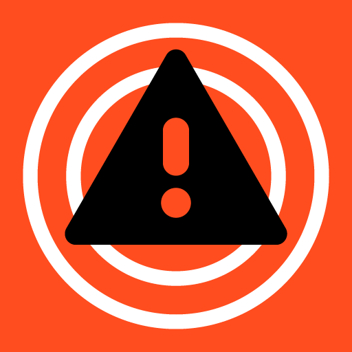
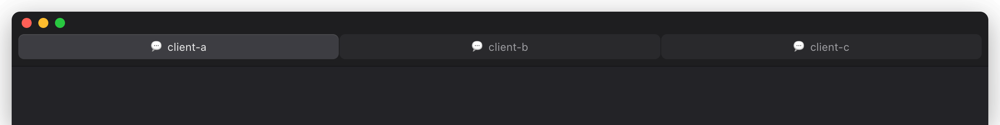

<h1 align="center">
   
  Radar for Claude Code
</h1>

<strong>💬 working&ensp;·&ensp;⚠️ needs you&ensp;·&ensp;🟢 done</strong>

  
  
  

**Claude Code multitasking, done right.** Run Claude across several projects and always know which one needs you, without clicking through window after window.

## Two features, one glance

**Live status in every window title** 
💬 working, ⚠️ needs you, 🟢 done. Every project, one look.

**macOS banners and sounds** 
A background window pings you when it needs you or finishes, one click jumps right in. The window you're looking at stays quiet.

> [!TIP]
> **VS Code on macOS has native tabs.** Set `"window.nativeTabs": true` and restart: every window packs into one tab bar, a live status board for all your Claudes. Radar works without them too (title bar, window switcher, Mission Control).

## Requirements

- VS Code ≥ 1.93 · Claude Code · **macOS only**
- `terminal-notifier` (Homebrew) makes banners clickable; without it you still get notification + sound

## Setup

Radar offers to set itself up on first launch. Or via the Command Palette: **Add ${claudeRadarStatus} to window.title**, then **Install Claude hooks** (writes to `~/.claude/settings.json`, backup first, other hooks stay put). Updates keep the hooks current automatically. Uninstalling? Run **Remove Claude hooks** first, then uninstall.

## Privacy & performance

- **No network, no telemetry.** Everything happens in local files.
- **Event-driven, not polling.** Idle cost is effectively zero.
- **Safe config writes.** Atomic, with a backup. Removal is one command.

## How it works

Six Claude hooks drop a file in `~/.claude/tab-status/`, named `sha256(project path)` (first 16 hex chars, realpath-resolved so symlinks match). The content is the status:

- `UserPromptSubmit` → `working` (purely visual, no banner/sound)
- `Notification` / `PermissionRequest` → `waiting`
- `PreToolUse` + `AskUserQuestion` → `waiting` (a question needs you too; its own hook, since AskUserQuestion fires neither Stop nor Notification)
- `PostToolUse` + `AskUserQuestion` → `working` (back to working after you answer, since no new `UserPromptSubmit` fires)
- `Stop` → `stop` (done), unless background work is still running, then `working` stays. Subagents, workflows, and monitors count as work (they finish and wake the session); background shell tasks don't, since a dev server Claude started would otherwise hold the working marker forever. Want shell tasks to count? Turn on `claudeRadar.shellTasksKeepWorking`.

Each window watches only its own file and shows the marker from **state + focus**:

- `working` stays visible the whole time, even in the active window, never with banner/sound, so nothing flickers.
- `needs you` / `done` show a persistent marker and banner only when the window's in the background (banner via `terminal-notifier`, a click focuses the right window). In the active window they flash for ~1 s ("peek") and fade.
- Focusing a window clears an attention marker; `working` stays, since Claude's still going.

Stale files (sessions with no matching window) are cleaned up after 24 h.

## Limits

- The marker is text (emoji) in the title, not a native tab badge, macOS doesn't allow those.
- `Stop` fires after every response. Fine for the marker and banner (idempotent, one banner per project, focused windows skipped).
- Multi-root workspaces: the first folder wins.
- Two events at once: the later one wins.

## Settings

Give just the symbol, the space is added for you. Empty means no marker for that status.

| Setting | Default | |
| --- | --- | --- |
| `claudeRadar.markerWorking` | `💬` | while Claude is working |
| `claudeRadar.markerWaiting` | `⚠️` | when Claude needs you |
| `claudeRadar.markerDone` | `🟢` | when Claude is done |
| `claudeRadar.banner` | `true` | macOS banner on/off |
| `claudeRadar.soundWaiting` | `Basso` | sound when needs you (empty = silent) |
| `claudeRadar.soundDone` | `Glass` | sound when done (empty = silent) |
| `claudeRadar.shellTasksKeepWorking` | `false` | background shell tasks (e.g. a dev server) keep the working marker |
